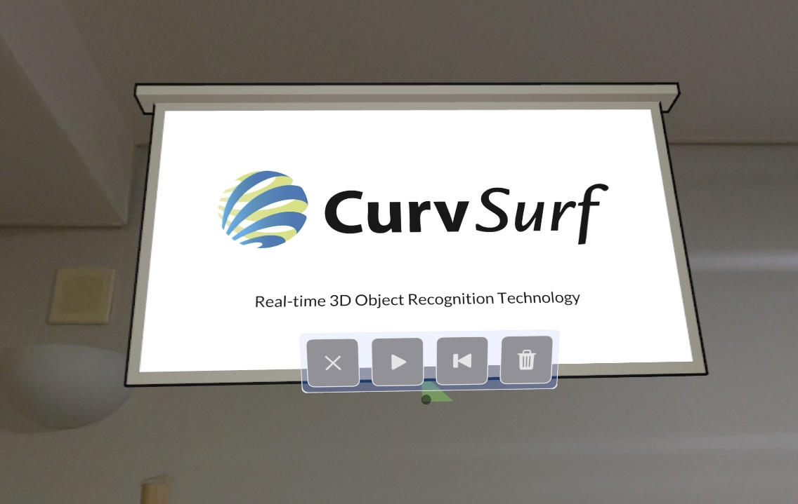
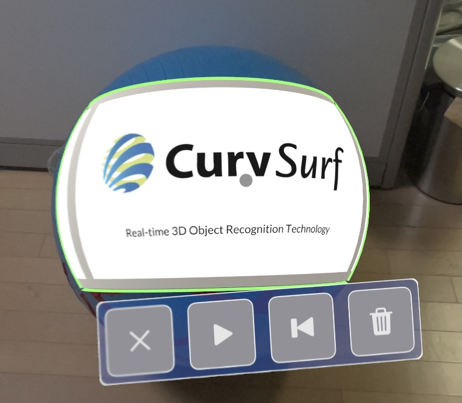
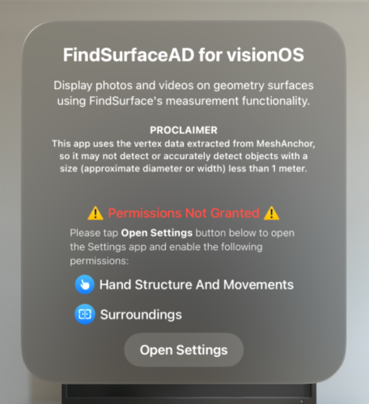
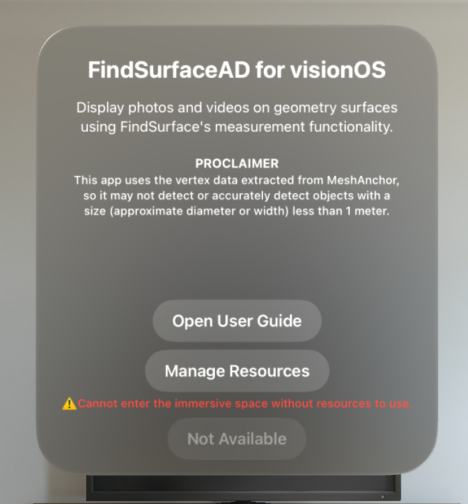
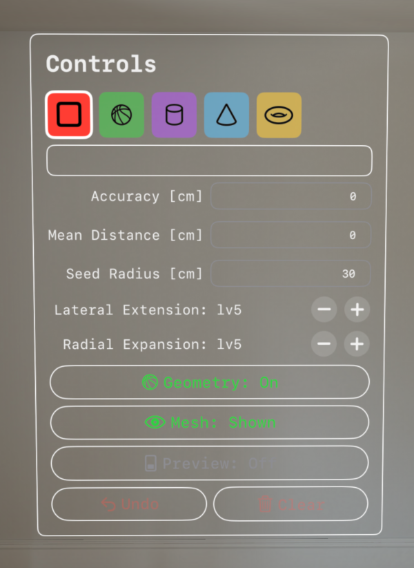
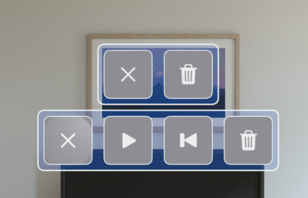
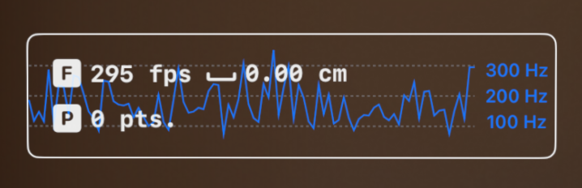
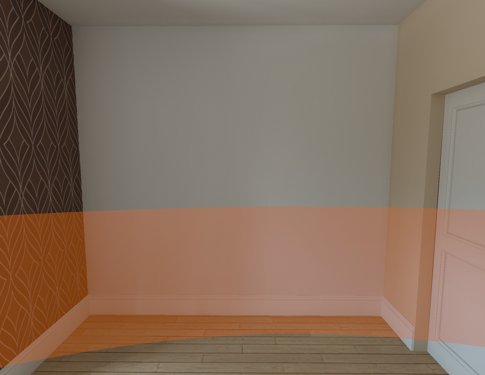
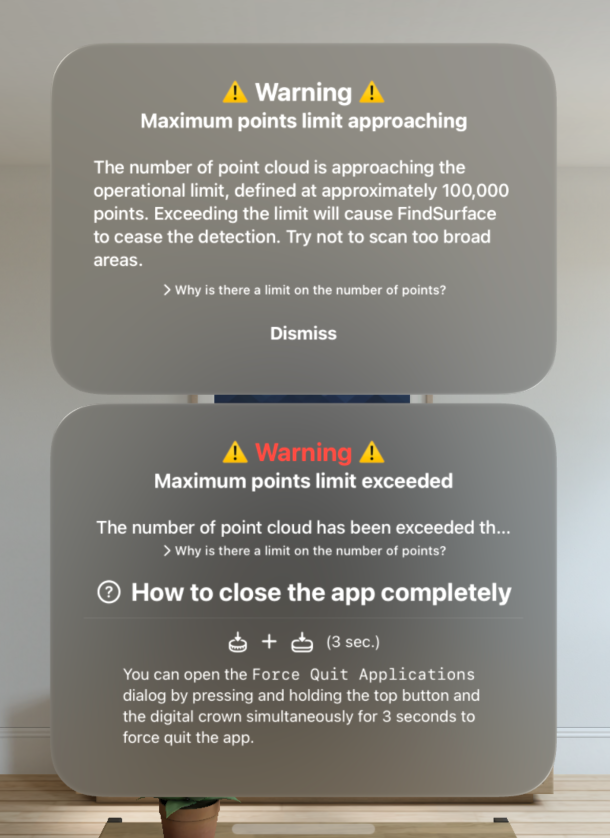

# FindSurface-RealityKit-visionOS-Advertisement

**Curv*Surf* FindSurface™ Advertisement Demo App for visionOS (Swift)**

## Overview

This demo app demonstrates a sample project that searches vertex points (provided by ARKit as mesh anchors) for geometries continuously fully utilizing features of [FindSurface-visionOS](https://github.com/CurvSurf/FindSurface-visionOS/tree/main) package. This app allows you to project or hang any images or videos on the surfaces of detected geometries.

This app operates very similarly to the previous two sample apps ([FindSurfaceRT-visionOS](https://github.com/CurvSurf/FindSurface-RealityKit-visionOS-Real-Time) and [FindSurfaceRR-visionOS](https://github.com/CurvSurf/FindSurface-RealityKit-visionOS-Response-to-Request)). However, instead of displaying the detected geometries as wireframes, it creates virtual screens where you can present or play images or videos of your choice, which are accessible through the Photos app on your device. Currently, only PNG images and MP4 videos have been tested. Videos can be played, paused, and rewound, and they are played with `SpatialAudio` for a 3D sound experience.

Imagine displaying an advertisement (not just a random image or video) on a ceiling, wall, floor, or pillar. This demo app demonstrates the concept at a proof-of-concept level with minimal functionality to prove its feasibility.

## Requirements

The app runs on an Apple Vision Pro (visionOS 2.0+) device only, and requires your permissions to track your hands and to scan your environment (world sensing) in order to operate as intended. Permission dialogs will appear upon launching the app.

## How to use

After launching the app, the startup window will appear. Click the `Enter` button to access the immersive space.

The device will start scanning your physical environment and generate mesh anchors. A black sphere will float in front of you to indicate the center of your sight. Unlike [our previous app](https://github.com/CurvSurf/FindSurface-RealityKit-visionOS), which utilizes eye-tracking position, the seed point location is determined by ray casting with the device location and the direction of CoP (center of projection) in your sight in `Preview mode` of this app. This indicator helps you aim at the place to search for geometries in `Preview mode`. The triangle hit by the ray casting will be highlighted in green.

Unlike the previous sample apps, virtual screens will appear when you detect geometries from the meshes, as well as the geometry objects (wireframe).

### Startup window

- `User Guide` displays you this page (this README.md file) in the app, thanks to the [swift-markdown-ui package](https://github.com/gonzalezreal/swift-markdown-ui).
- `Enter` starts the immersive space.

If you have never clicked `Don't allow` on the permission dialog, you won't see the `Permission Not Granted` section. It only shows up when you disallowed the necessary permissions. `Go to Settings` button will lead you to this app's section in the Settings app. After all the necessary permissions are granted, the `Enter` button will be enabled and it will restart the app when you click it.

When all necessary permissions are granted, click the `Manage Resources` button to select images or videos to import from your Photos app. Once at least one resource is imported, the label of the `Not Available` button will change to `Enter` and it will get enabled. Clicking it will take you to the immersive space.

### Controls Window

Controls window provides frequently used app controls. It will be displayed on the right side of your sight and can be relocated by pinching with the middle finger and thumb of your right hand.

- Feature type picker: The five shape icons are the feature types that can be selected to search for using FindSurface.

- Resource list: The empty space between the Feature type picker and `Accuracy` will display a list of images or videos imported by the user. While it is not shown in the above image, selecting an image or video here and detecting a geometry will create a virtual screen on the detected surface, displaying the resource.

- `Accuracy` represents the *a priori* root-mean-squared error of vertices of meshes.
- `Mean Distance` represents the average distance between the vertices.
- `Seed Radius` specifies the approximate radius of the region of interest (depending on the estimated size of the object to be detected). You can adjust this value by tapping the thumb and index finger of both hands together and moving your hands apart or closer.
- `Lateral Extension` represents the tendency for the algorithm to spread its search space in lateral (tangential) direction of the surface to be detected or measured.
- `Radial Expansion` represents the tendency for the algorithm to thicken/thin its search space in normal direction of the surface to be detected or measured.

For detailed explanations of the parameters, please refer to [FindSurface](https://github.com/CurvSurf/FindSurface#how-does-it-work).

For the recommended preset of the parameters, please refer to [Optimal Parameter Set for Apple Vision Pro](https://github.com/CurvSurf/FindSurface-visionOS#optimal-parameter-set-for-apple-vision-pro).

- `Geometry` toggles the visibility of the detected geometries.
- `Mesh` toggles the visibility of meshes. Disabling meshes automatically turns off Preview mode if it is currently enabled.
- `Preview` toggles `Preview mode`, which repeatedly calls FindSurface's detection function without any delay. When enabled, spatial taps on meshes capture the current preview geometry. If meshes are hidden, enabling Preview mode will automatically make them visible.
- `Undo` removes the latest captured geometry. The undo-stack will be cleared when you leave the immersive space, so the `Undo` button will be disabled. You can still remove an object separately via the entity menu (explained below).
- `Clear` removes all the captured geometries in the scene.

#### Entity Menu Window

The Entity Menu Window appears when you perform a long press (i.e., spatial tap and hold) while putting a virtual screen at the center of your sight (The outline of the object will be highlighted.)

If the object has an image, the upper window will appear, allowing you to **dismiss** it (cross icon) or **remove** the object (trash bin icon). If the object contains a video resource, the lower window will provide controls to **play/pause** and **rewind** the video, along with the same options as the image window.

#### Status Window

This view can be relocated by pinching with the middle finger and thumb of your left hand.

- `F` and fps stand for 'found-per-second', which is calculated from the average of time-intervals between the events that FindSurface detects a geometry.
- `P` and pts mean the number of points that FindSurface receives as input, which are obtained from the surroundings of user.
- `_`: The value following the fps indicates the RMS error (cm) of the latest detection in Preview Mode.
- Fps graph: When `Preview mode` is enabled, the change of the fps will be plotted on the background of the status view (not included in the screenshot above).
    > **Note**: '**found-per-second**' means how frequently the information about geometries around you are provided, but doesn't mean any performance score such as frame-per-second of when talking about how well GPUs perform. Also note that the X-axis of Fps graph is not related to the time scale but rather just records changes in fps only when the events occur.

#### Scene Boundary Entity

Since `FindSurface-visionOS` limits the number of input points (See [Here](https://github.com/CurvSurf/FindSurface-visionOS/tree/main#overview)), scanning excessively large areas to generate meshes may exceed this limit. To avoid exceeding the limit, the app defines a cylindrical boundary of **5 meters in height** (from the floor) and  **5 meters in radius**, centered at the **origin**, which is the device's location at the time of opening the immersive space. Mesh triangles outside this boundary are filtered out, not displayed, and cannot be interacted with, even if `visionOS` provides them.

The boundary is visualized as orange walls, as shown in the image above, when users approach within 1 meter of the boundary. Users can go out of the boundary, but interaction is limited to the meshes within the boundary.

> **Note**: The center of this boundary is determined when users open the immersive space (i.e., clicking the `Enter` button). If the scene is larger than this boundary, you can scan first in one area, then exit to `Home`, move to another place out of the boundary, and open the immersive space again to continue detecting geometries in there. Previously detected geometries and virtual objects are stored and managed as **persistent objects**, so you can still interact with them (e.g., play/pause, rewind, remove) even if they remain outside the new boundary.

#### Size Limitation of Input Point Cloud

If the number of points obtained from `MeshAnchor` within the **Scene Boundary** exceeds the threshold, a warning window like the one above will be displayed. When the point count is about **5,000 points below the threshold**, the upper window in the image will appear. if the threshold is exceeded, the content of the window changes to the lower window.

When this window is displayed:

- If the threshold is not yet exceeded, try not to move toward unscanned areas.

- If the threshold has already been exceeded, wait for `visionOS` to remove invisible mesh triangles or restart the app to rescan the surrounding environment.

### Known Issues

The following are known bugs or unimplemented features that may be addressed or improved in future updates:

- If a video resource was playing before exiting to the Home menu, re-entering the app result in audio and video being out of sync, with the audio starting from the beginning.

- **Debug mode only**: Mesh triangle filtering based on the scene boundary takes a significant amount of time, causing mesh updates to not process in real time. In rare cases, this may result in a crash.

- For **Torus** geometries, images/videos may appear flipped upside down, with a 180-degree rotation.

- In very rare cases, if you detect an object and immediately return to the Home menu and re-enter the app, it may fail to load previously detected objects from persistent data. This can result in the app being unable to launch. If fully-terminating and restarting the app doesn't resolve the issue, rebooting the device should fix the problem.

The following are issues caused by `visionOS` itself and cannot be resolved within the app:

- Virtual objects may appear displaced after restarting the app due to location errors in persistent anchors.
